# The NIST Q-D Interpreter Software

The NIST Q-D Interpreter software has been developed to help visualizing IEEE 802.11ad/802.11ay Beamforming Training (BT) results using 3D visualization. This software is part of the [NIST Q-D Framework](https://github.com/wigig-tools) and at such is using input from both the [NIST Q-D Channel Realization software](https://github.com/wigig-tools/qd-realization) and [ns-3 802.11ad/ay implementation](https://github.com/wigig-tools/wigig-module).

The NIST Q-D Interpreter software is developed in Python and uses the [Mayavi](https://docs.enthought.com/mayavi/mayavi/) library. 
It provides a flexible, scalable 3D visualizer to analyze BT results and more particularly:
* Sector-Level-Sweep (SLS) BT.
* SU-MIMO and MU-MIMO BT.
* Beamtracking results.

Recently, sensing visualizations were added to allow:
* Visualization of human targets moving and their associated Multi-Paths Components (MPCs).
* Visualization of the doppler range map.

It is worth mentioning that the The NIST Q-D Interpreter software comes with its own implementation of the Q-D propagation model which allows to visualize the BT results without having to perform any ns-3 system-level simulations. This mode is referred to the `Oracle Mode` in the Q-D Interpreter. 

This page is organized as follows:
* Section [Installation](#installation) describes how to install the NIST Q-D Interpreter software.
* Section [First Steps](#first-steps) helps to user to get familiar with the visualizer. In particular, it shows how to launch the visualizer and configure the different visualization options to customize the visualizer appearance.
* Section [SLS Visualization](#sls-visualization) describes how to visualize the SLS BT results.
* Section [MIMO Visualization](#mimo-visualization) explains how to visualize the MIMO results.
* Section [Sensing](#sensing-visualization) presents how to visualize the sensing results.
* Section [More about the Oracle Mode](#more-about-the-oracle-mode) gives more details on the additional capabilities of the Oracle mode. 
* Section [Misc](#misc) describes additional features of the Q-D Interpreter.

# Installation

To install the visualizer, we recommend using anaconda. 
To do so, you need first to install [Anaconda](https://www.anaconda.com/). 
Please select the installation for Python version 3.7 or higher. 
Once Anaconda is installed, open the Anaconda Prompt and use the following command:

`conda create -n yourEnvName python=3.7 pyqt=5 `

then:

`conda activate yourEnvName `

Install Mayavi:

`conda install -c menpo mayavi`

Install pyqtgraph:

`pip install pyqtgraph`

Install numba:

`pip install numba`

Install Pandas

`conda install -c anaconda pandas`

Install Quaternion

`conda install -c conda-forge quaternion`

Install Matplotlib

`conda install -c conda-forge matplotlib`


Install Scipy

`conda install -c anaconda scipy`

On windows system, there seems to be a bug (see [here](https://stackoverflow.com/questions/53889284/python-importing-mayavi-mlab-produces-syntax-error) ) 
So if using Windows and you face problems running the visualizer, perform the two following commands:

`pip uninstall apptools`

`pip install -U apptools`

You should be ready to use the Q-D visualizer.

# First Steps

## First time launch

To launch the visualizer, the scenario name must be specified using the `--s` option. For example, the command below will launch the visualizer for a scenario named `scenarioName`.
 
`python qdVisualizer.py --s scenarioName`

For the purpose of this section, we will use the `Raw Spatial Sharing` scenario as an example scenario. It gives us the following command:

`python qdVisualizer.py --s RawSpatialSharing`

The first time a scenario is launched, it just reads the input from the NIST Q-D channel realization software and ns-3 and nothing is configured for the visualization itself. Once the visualizer is launched, you should obtain the visualization displayed on the figure below.


We can observe that the visualizer is made of two main windows that we will refer to as `Left View` and `Right view`. The `left` view is used to display the entire topology, i.e, the devices, their names, and their associated Phased Antenna Arrays (PAA). The `right` view is used to display the MPCs between the selected transmitter/receiver pair, and the BT results if available.
The first time that a scenario is launched, all the faces of the 3D geometry of the environment are set to be opaque. 
The first thing to do is to configure the visualization correctly to display what we want to visualize. 


## Configuring the 3D environment appearance 
For an indoor scenario such as the `Raw Spatial Sharing` scenario, we must select the faces to hide to be able to visualize the indoor environment. 
To do so, click on the `Environment Interaction` tab in the GUI. 
Then, select the top face of the left view. 
It should be now colored in red to state that it is currently selected as displayed in the figure below.

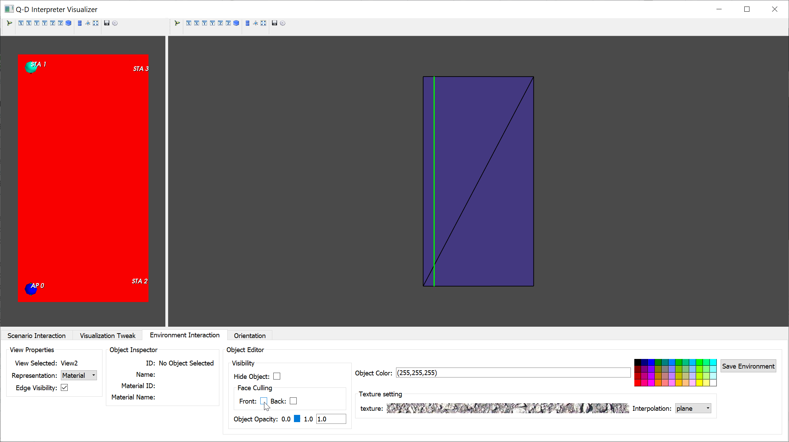

Finally, click on the option `Front` that appears in the `Face Culling` box. 
The top face of the room should now be hidden. `Front` face culling must be used to hide a face whose normal is facing the camera while `Back` face culling` is doing the opposite. 

You should now have a view of the inside of the room on the `left view` as displayed on the picture below. 

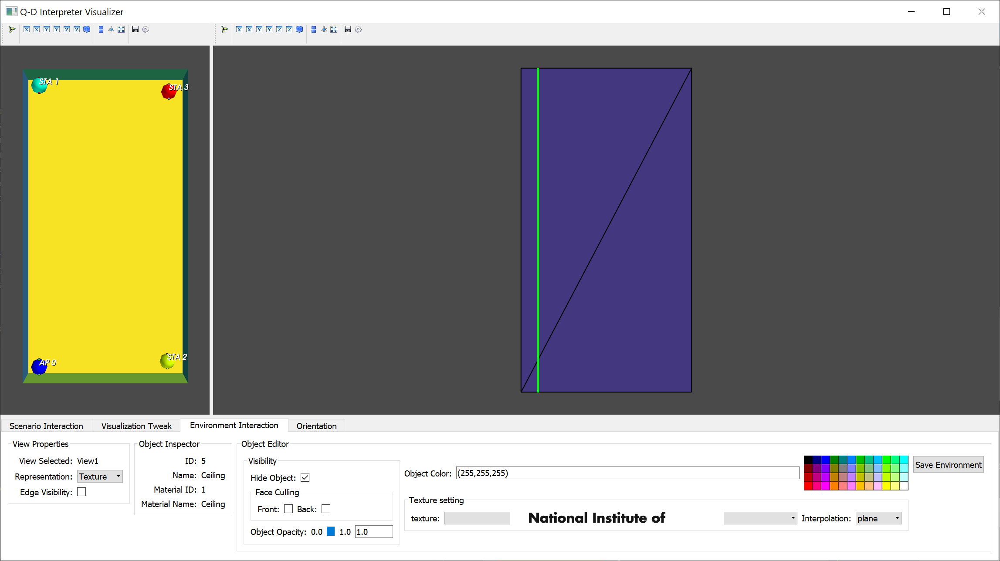

We can observe tha the `Raw Spatial Sharing` scenario is made of 4 devices. One Access Point (AP), AP0, and three Stations (STAs), STA1, STA2, and STA3. To configure the devices and their type, please check Section [Assign Device role](#assign-devices-role). 

Try now to apply front face culling to the side faces in order to reveal more of the inside of the room on both the `left` and `right` view. The video below summarizes all the steps to perform to obtain a view that can be used for visualization purpose. 

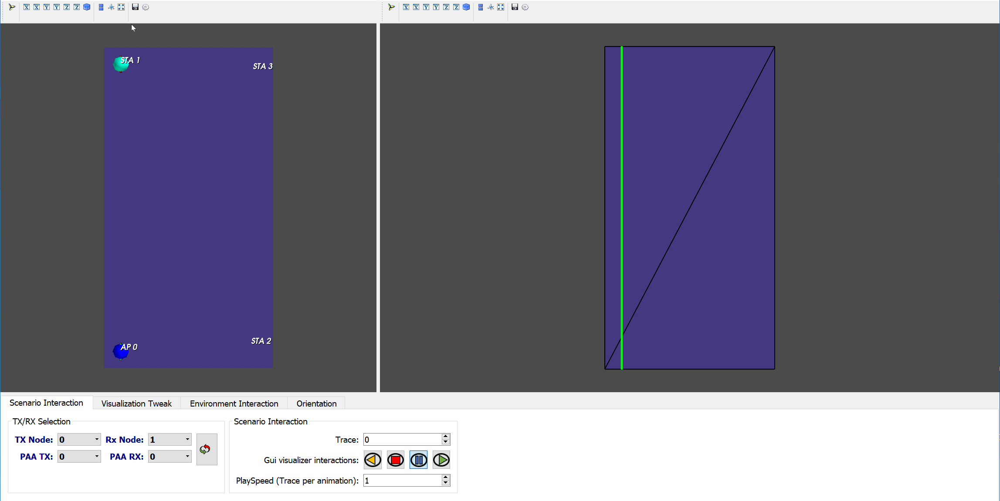

If you want to keep the visualization configuration created for the scenario, just hit the `Save Environment` button highlighted in the picture below and the configuration will be loaded the next time you launch the scenario. 

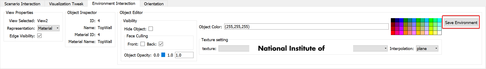

## Tweaking nodes, antenna arrays and MPCs appearance
When the visualizer is launched for the first time for a scenario, it is using default values for:
* Nodes size.
* Nodes labels. 
* Phased Antenna Arrays (PAAs) size.
* MPCs size and colors.
* On wich views to display nodes, nodes 3D Models, nodes labels and PAAs.

After the configuration done in the previous [section](#configuring-the-3D-environment-appearance), the `Raw Spatial Sharing` scenario is as depicted on the figure below. 

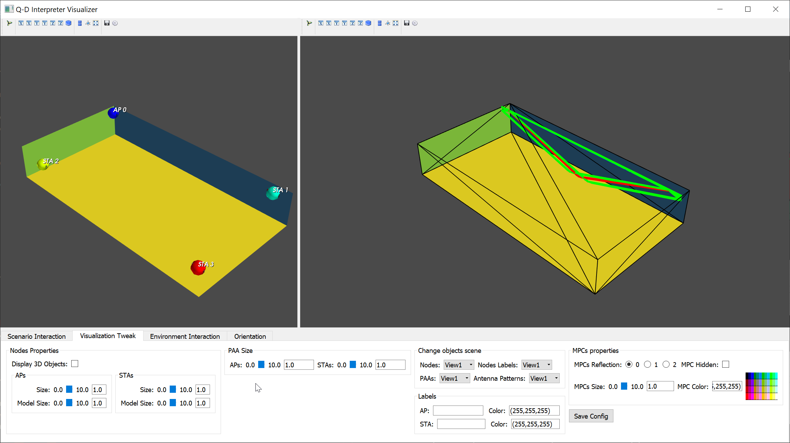

We can see that the MPCs different reflections order are hard to distinguish and that the nodes PAAs are barely visible.  

The NIST Q-D interpreter can be used for a wide variety of scenario (indoor, outdoors, all variable in size) and thus requires an initial configuration of the nodes, PAAs, and MPCs visualization when first launching a scenario. 

To do so, one must select the `Visualization Tweak` tab in the GUI.

Each node is represented by a 3D sphere. Set the STAs and APs size to `0.4` as displayed below. 

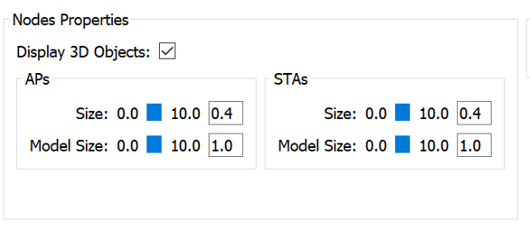

Each node PAA element is represented with cubes. Set the PAA size to `2` as displayed below. 

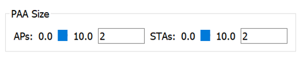

By default, MPCs all have the same width and LoS MPC is colored in blue, 2nd order reflection in red, and third order in green. Set the LoS reflection thickness to `0.1` by selecting `MPCs reflection` `0` in the list and set `MPCs size` to `0.1` as displayed below.

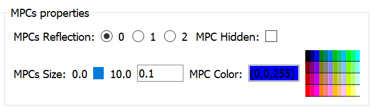

Proceed the same way to set the 1st order reflection to `0.05` and 2nd order reflection to `0.01`.

The visualization of the scenario should now look like the picture displayed below and we can clearly see the devices, the PAAs, and distingish the MPCs corresponding to each reflection order. 

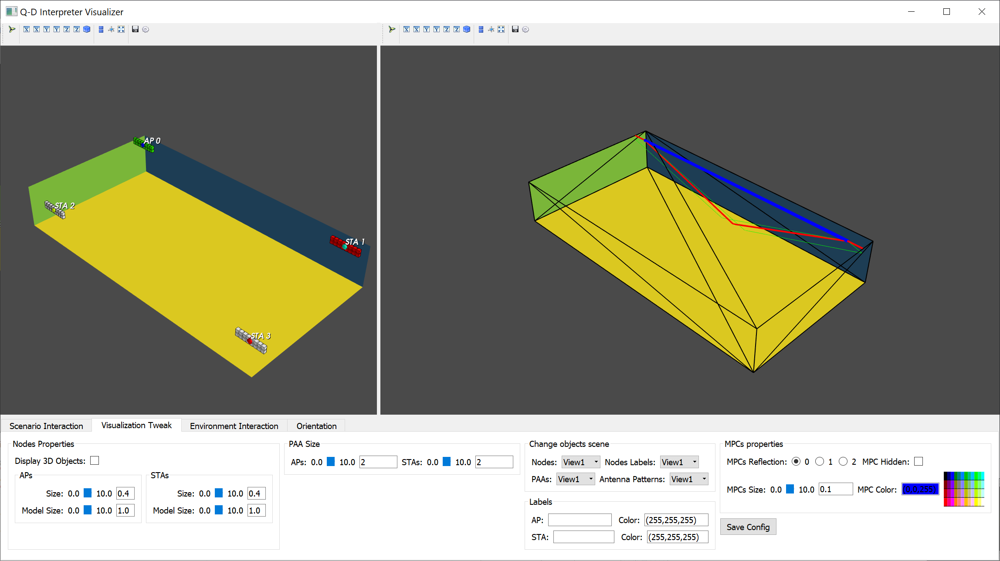

Please note that Nodes (APs+STAs) representations, labels and PAAs can either be displayed on `left` view or `right` view. To do so, use the `Change Objects Scene` in the GUI. `left` view is refered as `view` and `right` view as `view2`. 

If you want to save the configuration, just click on `Save Config` as displayed below.

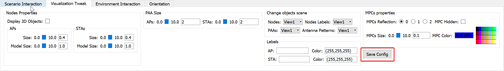

The next time the visualizer will be launched for this scenario, the configuration done will be used to display Nodes, PAAs, and MPCs. 

Each type of nodes (APs or STAs) can also use a 3D model. For this, click on the `Display 3D Objects` as displayed below.

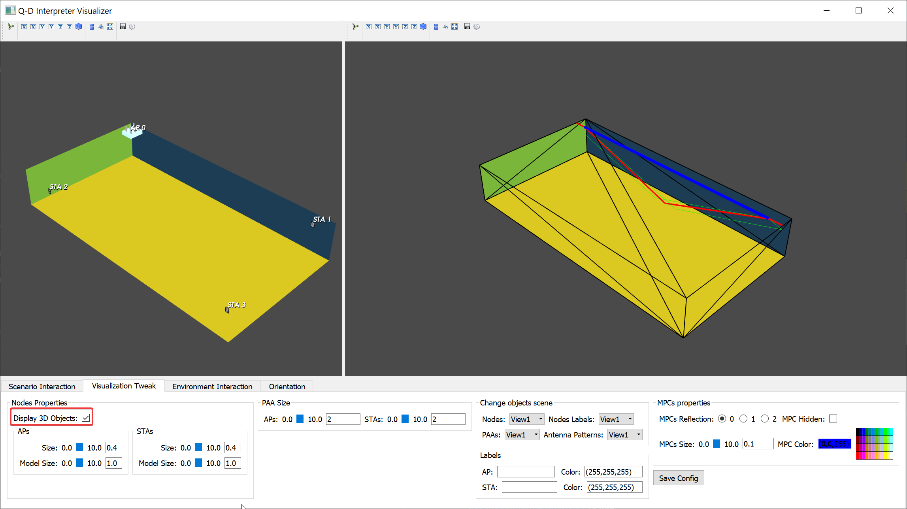

There are two defaults models in the repository (one for the STAs and one for the APs).
The AP model is displayed below. 

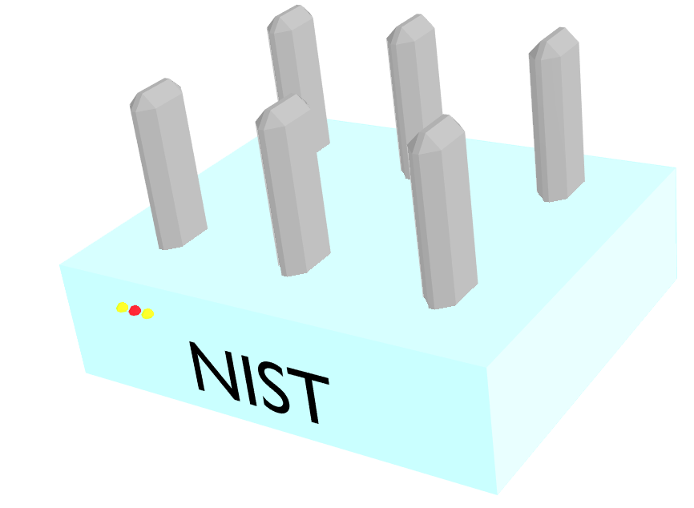

The STAs model is displayed below.

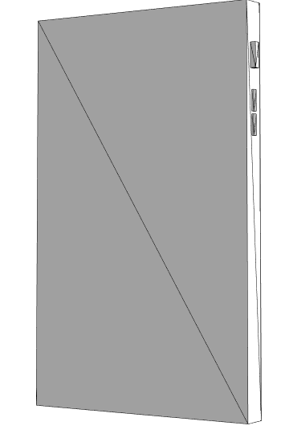

Please note that these 3D models are pretty simple. One can still import any 3D models in the visualizer. To do so, please refer to Section [Custom 3D models](#add-custom-3d-models-for-aps-and-stas) .  

## Interacting with a scenario

The `Raw Spatial Sharing` scenario is made of 1 AP (AP0) and 3 STAs (STA1, STA2, STA3). The scenario is made of 100 traces and STA3 is the only node moving along the y-axis. To interact with the scenario, select the `Scenario Interaction` tab in the GUI. 

To go to a specific trace, just enter the traces you want to visualize in the `Trace` GUI as displayed below for example to go to trace `9`.

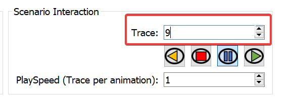

To iterate over the traces, the toolbar displayed below is provided. 

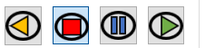

One can either going forward (play icon), backward (rewind icon), pause (pause icon), or go back to trace 0 (stop icon). It is worth mentionning that the trace iteration is set by default to `1` and can be changed using the `Playspeed (Trace per Animation)` value.

The video below shows the iteration over all the traces.

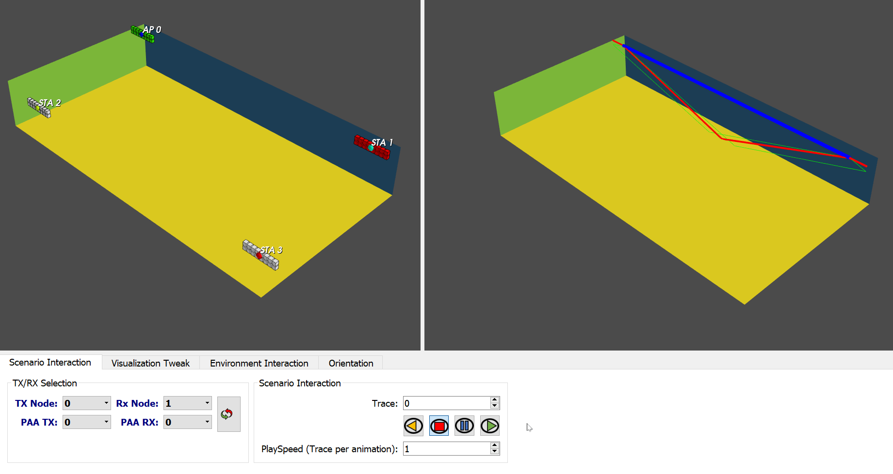

On this video, we can observe STA3 moving along the y axis as expected. However, the right view remains static. It is as expected as by default, the visualizer displays the MPCs for a transmitter set to `node 0` (AP0) and `node 1` (STA1) as a receiver. Both of these nodes are static so the MPCs remain the same all along the scenario.

To change the transmitter or receiver node, just change the value of `TX Nodes` and `Rx Nodes` in the GUI as displayed below in the video. 

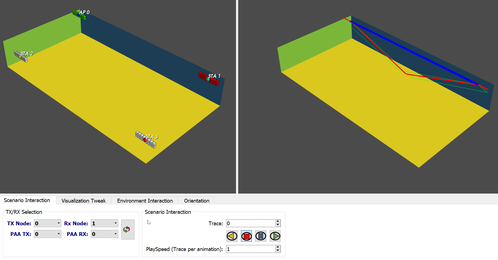

Now, we can see that when the transmitting node is set to 0 and the receiving node is set to 3, the MPCs are updated each trace. 

# SLS Visualization

There are two ways to visualize the SLS BT:
* **Oracle mode**: the SLS BT results are computed by the NIST Q-D Interpreter. 
* **ns-3 results**: the SLS BT are imported from system-level simulations performed using ns-3. 

In order to enable the SLS visualization, the option `--sls` must be used. To demonstrate SLS BT visualization, we are going to use the `LRoom` scenario. This scenario is made of 200 traces and is delivered already preconfigured (3D environment faces to display, MPCs size, nodes size, etc.). The scenario is made of one static AP and one STA that is moving first along the x-axis (first 56 traces) and then to the y-axis. 

## SLS Visualization with the Oracle mode

The oracle mode allows to visualize SLS results without running the scenario in ns-3. The Q-D propagation model developped in ns-3 has been reimplemented in Python to obtain the SLS BT results.

To visualize SLS Oracle results, two modes are available:
* **online**: The SLS results are computed while visualizing. This method allows to load the scenario faster but is slower to display the SLS results.
* **preprocessed**: The entire SLS results between every pair of nodes are computed the first time that the scenario is launched, and saved for the next time the scenario will be visualized. This method is slower to launch the first time, but faster to display the SLS results when visualizing the scenario, and faster to load the next time the scenario is launched.

It is worth mentionning that the configuration of this mode requires to add the option `dataMode`. By default, the `dataMode` is set to `none` and the oracle SLS results are not available. 

### Oracle SLS Online Mode

To launch the `Lroom` scenario with the Oracle SLS activated and set to `online`, execute the following command.

`python qdVisualizer.py --s LRoom --sls --dataMode online`

Then, just iterate through the traces using the `Play` button. 


We can see that the Tx and Rx antenna patterns are updated based on the MPCs. 

### Oracle SLS Preprocessed Mode

To launch the `LRoom` scenario with the Oracle SLS activated and set to `preprocessed`, execute the following command.

`python qdVisualizer.py --s LRoom --sls --dataMode preprocessed`


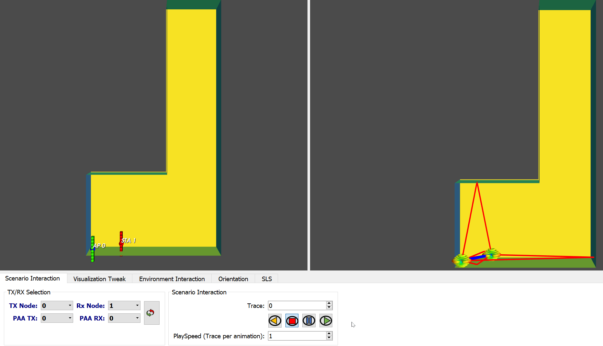

We can observe that the SLS is slighly faster to visualize than in the `online` mode even if the overhead generated by the video capture is decreasing the difference in speed for both mode in real utilization.

## Visualizing plots

When the oracle mode is used, you can activate plots generation for deeper analysis. To do so, the option `--curves` must be used. 

The plots available are:
* Receiver Power.
* Received Power per Codebook Sector for the transmitter codebook complete Sector Sweep.
* Power Spectral Density. Please note that this plot is not available when `dataMode` is set to preprocessed. 

To visualize the plots, use the following command:
`python qdVisualizer.py --s LRoom --sls --dataMode online --curves`

The video below shows how to visualize the 3 available plotss from AP (device 0) to STA (device 1) and from STA to AP. 


## SLS Visualization with ns-3 Results

For this mode, the scenario must have been executed in ns-3 to obtain the SLS results file (please check ns-3 802.11ad/ay documentation to see how to proceed).
For the `LRoom` scenario available in this repository, the ns-3 results file is already included. It is located in `\LRoom\Output\Ns3\Results\SLS`. The SLS file is named `sls_1.csv`.
If you want to import new results, just replace this file. 

To enable the visualization of the ns-3 SLS results, select the `SLS` tab and switch the value from the GUI field `SLS from` to ns-3. The video below displays the SLS results obtained with ns-3.

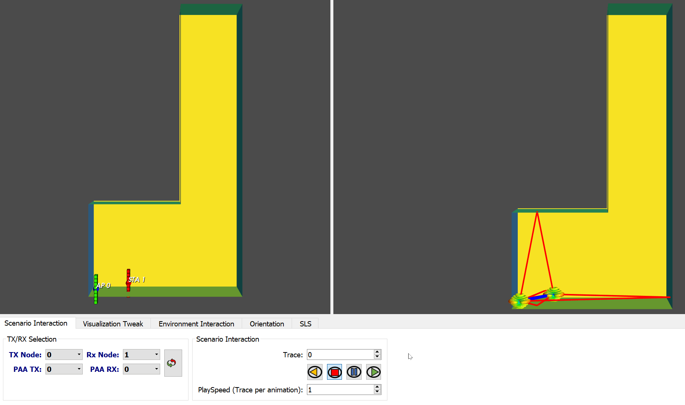

Please note that you can also iterate the ns-3 results based on their BT ID. ns-3 will not perform a beamforming every trace (oracle mode does) and thus, you can iterate for every transmitter/receiver pair whenever a BT has been performed. To do so, change the value in the GUI of the `BFT trace` field as displayed in the video below. 

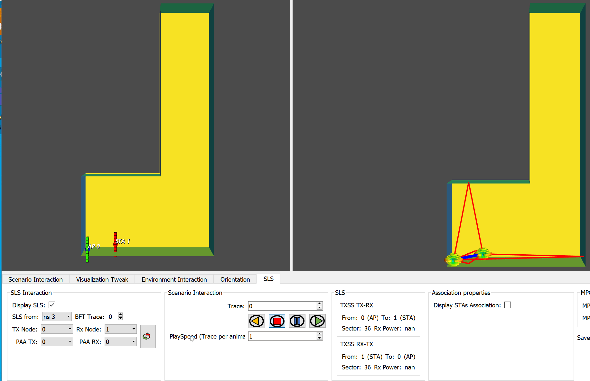

## Customize SLS visualization

You can customize the SLS visualization and in particular:
* Change the antenna patterns size and opacity.
* Change the MPCs colors and width.

To change the antenna patterns size and opacity, click on the `Visualization Tweak` tab in the GUI.
Then, you can either change the `size` or `opacit`y of the APs or STAs antenna patterns as displayed below.

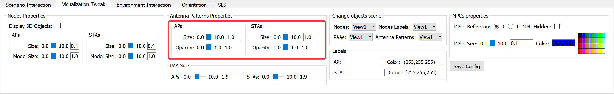

To change the MPCs colors and width, on the same tab, click on the reflection order you want to edit and use `MPCs size` to change the width of the MPCs of the selected reflection order, and `Color` field to change its color as displayed below.  

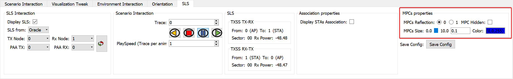

# MIMO visualization
The NIST Q-D Interpreter allows to visualize:
* **SU-MIMO BT**: results obtained from the oracle or ns-3. Beamforming applied is analog.
* **MU-MIMO BT**: results obtained from the oracle or ns-3. Beamforming applied is analog.
* **SU-MIMO Beamtracking**: results obtained from the NIST IEEE 802.11ay PHY. Beamforming applied is either analog or hybrid (analog+digital).

**It is worth worth mentionning that the Oracle MIMO results are still in beta and needs to be validated versus the ns-3 MIMO implementation. The algorithm used for both ns-3 and oracle MIMO BT is inspired from the top K joint SNR described [here](https://arxiv.org/ftp/arxiv/papers/1703/1703.05650.pdf). More information about the MIMO BT algorithm can be found in this [article](https://dl.acm.org/doi/abs/10.1145/3460797.3460799). However, both (ns-3 and oracle) `top K` algorithm implementations has been performed independently. A cross-validation phase will be conducted to investigate the inconsistencies of the results between the oracle mode and ns-3.**

## SU-MIMO 
For SU-MIMO BT results, we will use the scenario `suMimo2x2d3cm`. 
This scenario is made of one AP and one STA. Both of them are equipped with 2 PAAs, and each antenna is separated by 3cm along the Y-axis as displayed in the picture below. 


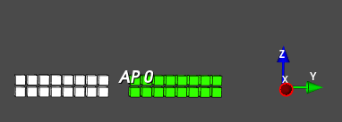

The scenario is made of 30 traces with the STA moving along the X-axis. Please also note that the scenario is delivered already preconfigured (3D environment faces to display, MPCs size, nodes size, etc.) The SU-MIMO results from ns-3 are also provided and located in `suMimo2x2d3cm\Output\Ns3\Results` folder. The file `SuMimo_0_1_1.csv` and `SuMimo_1_0_1.csv` contains the results of the SU-MIMO BT between Node `0` (the AP) and node `1` (the STA), and node `1` (the STA) and node `0` (the AP), respectively.

### SU-MIMO BT ns-3 results

To launch SU-MIMO scenario and visualize ns-3 SU-MIMO BT results, you need to execute the following command:

`python qdVisualizer.py --s scenarioName --mimo suMimo`

where `scenarioName` is the name of the scenario. We want to visualize the results for `suMimo2x2d3cm` scenario so execute the following command:

`python qdVisualizer.py --s suMimo2x2d3cm --mimo suMimo`

Once the visualizer is launched, to enable SU-MIMO visualization, click on the `suMimo` tab in the GUI. Then, click on the `Display MIMO` checkbox as displayed below. 

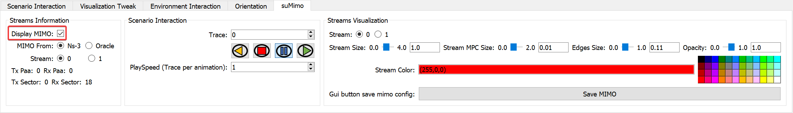

The visualization should now look like the picture display below. 

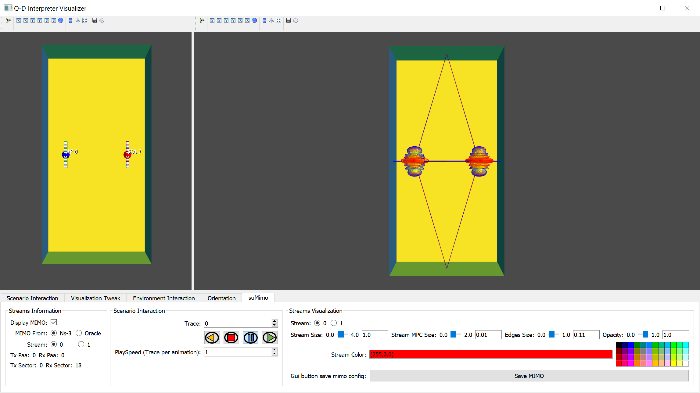

In this view, both SU-MIMO streams are displayed at the transmitter and receiver. Each Tx/Rx stream is colored with a unique color. For this trace, the Stream `0` corresponds to the transmitter `PAA 0 Sector 0` and the receiver `PAA 0 Sector 18` as displayed in the GUI (see picture below). 

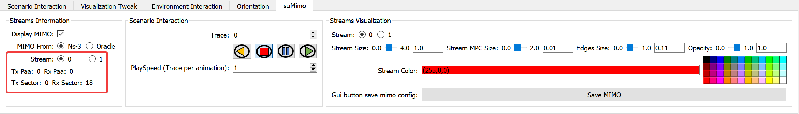

The color of the stream `0` is set to red as displayed in the GUI in the field `Stream Color`. The color is applied for the stream antenna patterns edges and MPCs colors. The second stream color is set to blue. If you zoom in, you can distinguish the MPCs of the two streams as displayed below (and you can also observe the two antenna patterns corresponding to each stream on each device thanks to the edges color):


If you want to switch stream (either to change the appearance of the stream or to know which Tx/Rx PAA/Sectors it is using), click on the stream that you want to select using the `Stream` field in the GUI. 


The video below shows the complete results of the ns-3 SU-MIMO BT for all the traces. 

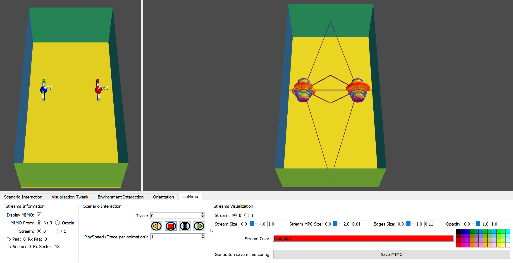

### SU-MIMO BT oracle results (**BETA**)
To visualize SU-MIMO BT oracle results, two modes are available:
* `online`: The SU-MIMO BT results are computed online whenever the user iterates through a new trace. This mode is faster to launch but slower to iterate over the traces.
* `preprocessed`: The SU-MIMO BT results are computed the first time the scenario is launched and saved for future scenario usage of this scenario. This mode is slower to launch the first time a scenario is executed, but faster to launch the second time and faster to iterate between traces afterwards. 

To select the mode, `--mimoDataMode` option must be used. The default value is set to `none`, i.e, the oracle SU-MIMO results are not available. 

#### SU-MIMO Oracle online results
To visualize the SU-MIMO BT results using the oracle in `online` mode, execute the following command:

`python qdVisualizer.py --s suMimo2x2d3cm --mimo suMimo --mimoDataMode online`

Then, once the visualizer is ready, select the `suMimo` tab in the GUI and change the `MIMO from:` field from `Ns-3` to `Oracle` as displayed below. 

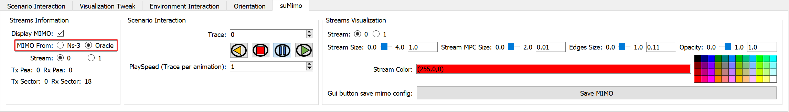

Finally, to enable SU-MIMO visualization, click on the `Display MIMO` checkbox. 

The visualization of the results is shown in the video below:


The SU-MIMO BT results are obtained using `top K = 20` when `--mimoDataMode` is set to `online`. 

**Please note that these results are not the same as the ns-3 results presented above. Please check [MIMO](#mimo-visualization) section for more information.**

#### SU-MIMO Oracle preprocessed results

To visualize the SU-MIMO BT results using the oracle set in `preprocessed` mode, execute the following command:

`python qdVisualizer.py --s suMimo2x2d3cm --mimo suMimo --mimoDataMode preprocessed`

Then, select the `suMimo` tab in the GUI and change the `MIMO from:` field from `Ns-3` to `Oracle` as explained above and finally, click on `Display MIMO`. 

The visualization of the results is shown in the video below:

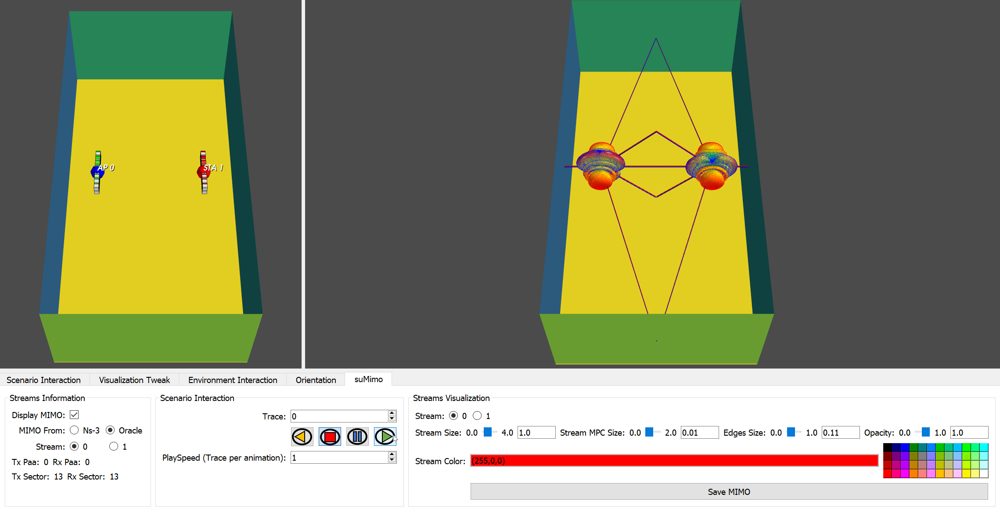

The SU-MIMO BT results are obtained using `top K = 200` when the `--mimoDataMode` is set to `preprocessed`. It explains why the results for the `preprocessed` mode are different from the ones obtained in the `online` mode previously presented. `online` mode computes the results on-the-fly so `top K` value has been set to a lower value (`20`) to speed up the rendering. 

**Please note that these results are not the same as the ns-3 results presented above. Please check [MIMO](#mimo-visualization) section for more information.**


## MU-MIMO

For MU-MIMO BT results, we will use the scenario `muMimo2x2d7cm`. 
This scenario is made of one AP and two STAs (STA1 and STA2). The AP is equipped with 2 PAAs, and each antenna is separated by 7cm along the Y-axis as displayed in the picture below. 

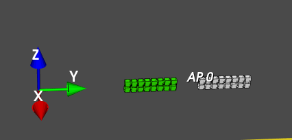

The STAs are equipped with one PAA. The scenario is made of 50 traces with both STAs moving along the X-axis. Please also note that the scenario is delivered already preconfigured (3D environment faces to display, MPCs size, nodes size, etc.) The MU-MIMO results from ns-3 are also provided and located in `muMimo2x2d7cm\Output\Ns3\Results` folder. The file `MuMimo_I_0_1_1.csv` contains the MU-MIMO BT results from node `0` (the AP) to node `1` (STA1) and `2` (STA2). `MuMimo_R_1_1_1.csv` contains the MU-MIMO BT results from node `1` (STA1) to node `0` (the AP) while `MuMimo_R_2_1_1.csv`  contains the MU-MIMO BT results from node `2` (STA2) to node `0` (the AP).

### MU-MIMO BT ns-3 results

To launch MU-MIMO scenario and visualize ns-3 MU-MIMO BT results, you need to execute the following command:
`python qdVisualizer.py --s scenarioName --mimo muMimo`

where `scenarioName` is the name of the scenario. We want to visualize the results for `muMimo2x2d7cm` scenario so execute the following command:

`python qdVisualizer.py --s muMimo2x2d7cm --mimo muMimo`

To enable MU-MIMO visualization, click on the `muMimo` tab. Then, click on the `Display MIMO` checkbox as displayed below. 

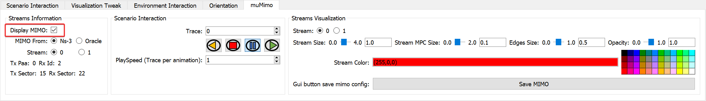

The visualization should now look like the picture display below. 

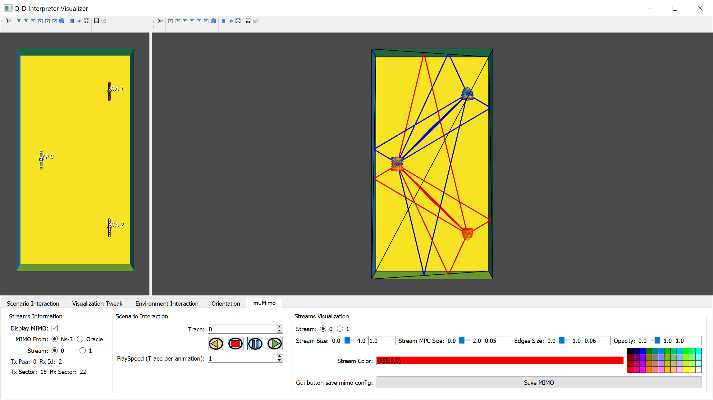

In this view, both MU-MIMO streams are displayed at the transmitter and receivers. Each Tx/Rx stream is colored with one color. For this trace, the Stream 0 corresponds to the transmitter `PAA 0 sector 15` and to the receiver `2 sector 22` as displayed in the GUI (see picture below). 

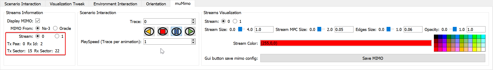

The color of this stream is set to red as displayed in the GUI in the field `Stream Color`. The color is applied for the stream antenna patterns edges and MPCs colors. The second stream color is set to blue.

If you want to switch stream (either to change the appearance of the stream or to know which Tx/Rx PAA/Sectors it is using), click on the stream that you want to select using the `Stream` field in the GUI.

The video below shows the complete results of the MU-MIMO BT for all the traces. 

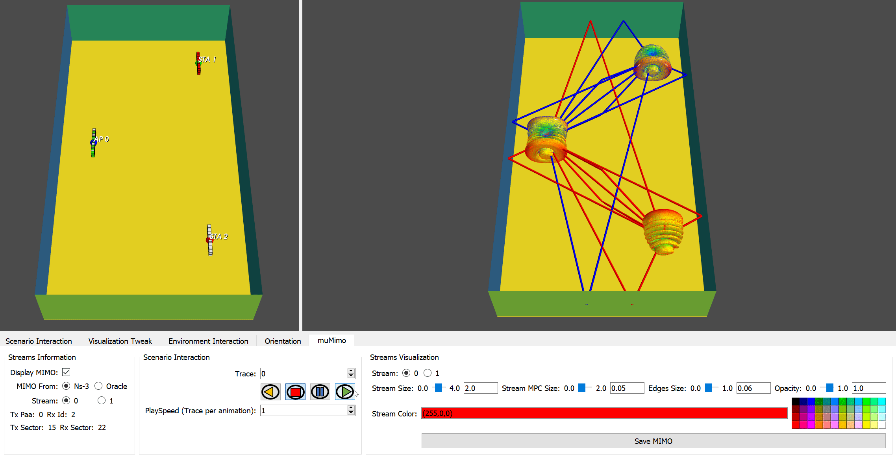

### MU-MIMO BT oracle results (**BETA**)
To visualize MU-MIMO BT oracle results, two modes are available:
* `online`: The MU-MIMO BT results is computed online whenever the user iterates through a new trace. This mode is faster to launch but slower to iterate over the traces.
* `preprocessed`: The MU-MIMO BT results are computed the first time the scenario is launched and saved for future scenario usage of this scenario. This mode is slower to launch the first time a scenario is executed, but faster to iterate between traces. 

To select the mode, `--mimoDataMode` option must be used. The default value is set to `none`, i.e, the oracle MU-MIMO results are not available. 

#### MU-MIMO Oracle online results
To visualize the MU-MIMO BT results using the oracle set to `online` mode, execute the following command:

`python qdVisualizer.py --s muMimo2x2d7cm --mimo muMimo --mimoDataMode online`

Then, select the `muMimo` tab in the GUI and change the `MIMO from:` field from `Ns-3` to `Oracle`d finally, click on `Display MIMO`.


The visualization of the results is shown in the video below:

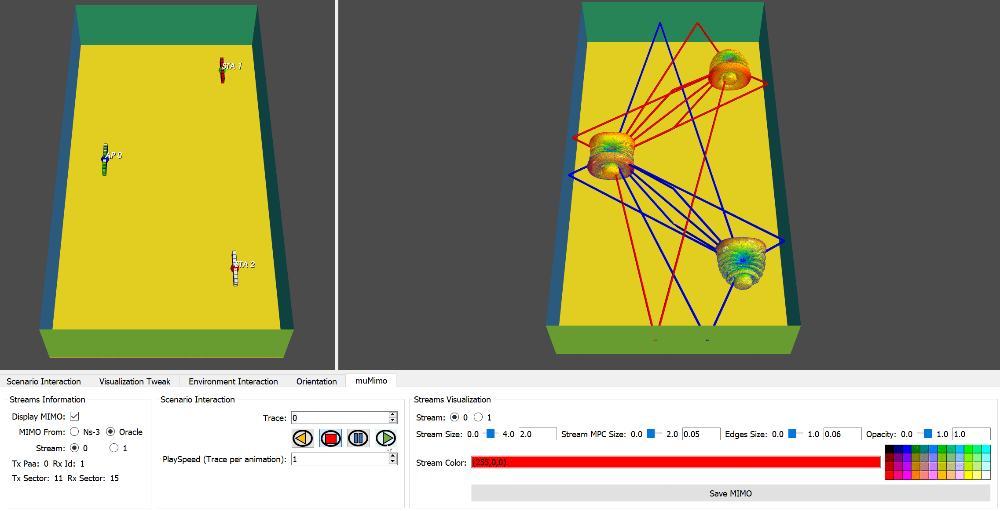

The MU-MIMO BT results are obtained using `top K = 20` when `--mimoDataMode` is set to `online`. 

**Please note that these results are not the same as the ns-3 results presented above. Please check [MIMO](#mimo-visualization) section for more information.**

#### MU-MIMO Oracle preprocessed results

To visualize the MU-MIMO BT results using the oracle set to `preprocessed` mode, execute the following command:

`python qdVisualizer.py --s muMimo2x2d7cm --mimo muMimo --mimoDataMode preprocessed`

Then, select the `muMimo` tab in the GUI and change the `MIMO from:` field from `Ns-3` to `Oracle` as explained above. 

The visualization of the results is shown in the video below:


The MU-MIMO BT results are obtained using `top K = 200` when `--mimoDataMode` is set to `preprocessed`. It explains why the results for the `preprocessed` mode are different from the ones obtained in the `online` mode previously. `online` mode computes the results on-the-fly so `top K` value has been set to a lower value (`20`) to speed up the rendering. 

**Please note that these results are not the same as the ns-3 results presented above. Please check [MIMO](#mimo-visualization) section for more information.**

## SU-MIMO Beamtracking

SU-MIMO beamtracking utilizes results provided by the NIST 802.11ay PHY implementation. This implementation uses a custom beamtracking algorithm to reduce the BT overheaded while guaranteeing SU-MIMO communication. SU-MIMO beamtracking algorithm can either provide:
* SU-MIMO analog beamtracking results
* Hybrid beamtracking results

For SU-MIMO beamtracking results, we will use the scenario `suMimoBeamTracking4x4`. 
This scenario is made of one AP and one STA. Both of them are equipped with 4 PAAs. In this scenario, every PAA is having the same location which is the centroid of the node itself. This scenario is made of 610 traces.

Please also note that the scenario is delivered already preconfigured (3D environment faces to display, MPCs size, nodes size, etc.) The SU-MIMO beamtracking results from the NIST 802.11ay PHY are also provided and located in `\suMimoBeamTracking4x4\Output\Results\BeamTracking` folder. The file `analogBT.csv` contains the analog beamtracking results from the AP to the STA. The file `digitalCombiner.json`c contains the complex weights from the digital beamformer of the STA while `digitalPrecoder.json` contains the complex weights for the digital beamformer of the AP.

### SU-MIMO analog beamtracking results 
To visualize the analog beamtracking results, execute the following command:

`python qdVisualizer.py --s suMimoBeamTracking4x4 --mimo beamTracking --codebookMode linear`

Please note the usage of the option `codebookMode` with `linear` as a parameter (please see Section Section [Linear or dB representation](#linear-or-db-representation) for more information about this option). It allows to represent the antenna pattern in the linear domain (instead of `dB`). For scenario with numerous streams, it is more convenient to display the results in linear. 

Once the visualizer is launched, select the `beamTracking` tab in the GUI and click on the `Display MIMO` checkbox.

The visualization should look like the picture displayed below. 

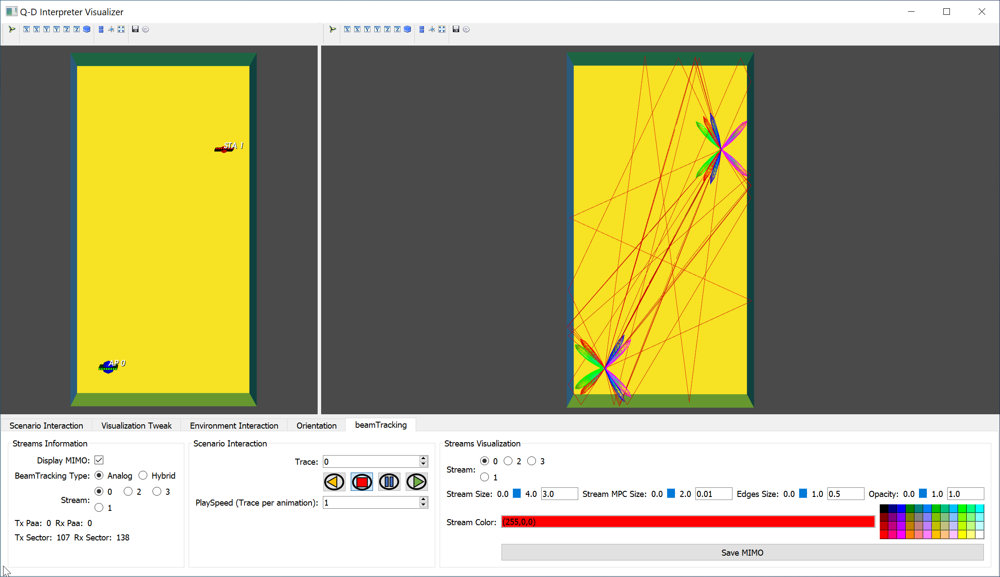

A total of 4 streams can be visualized. Each stream is identified by a different color, i.e., the transmitter and receiver antenna patterns for a given stream have the same color. 

The video below shows the SU-MIMO beamtracking results for the first 50 traces of the scenario. 


### SU-MIMO hybrid beamtracking results

To visualize the hybrid beamtracking results, execute the following command:
`python qdVisualizer.py --s suMimoBeamTracking4x4 --mimo beamTracking --codebookMode linear`

Once the visualizer is launched, select the `beamTracking` tab in the GUI and change the `BeamTracking Type` field to `Hybrid` as displayed below.

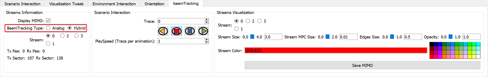
 
Finally, click on the `Display MIMO` checkbox.

The visualization should look like the picture displayed below. 

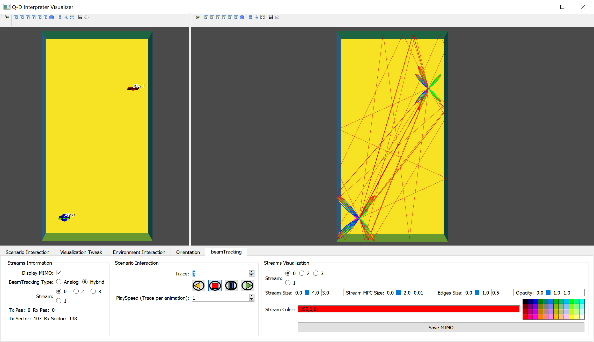

A total of 4 streams can be visualized. Each stream is identified by a different color, i.e., the transmitter and receiver antenna pattern for a given stream have the same color. 

The video below shows the SU-MIMO beamtracking results for the first 50 traces of the scenario. 

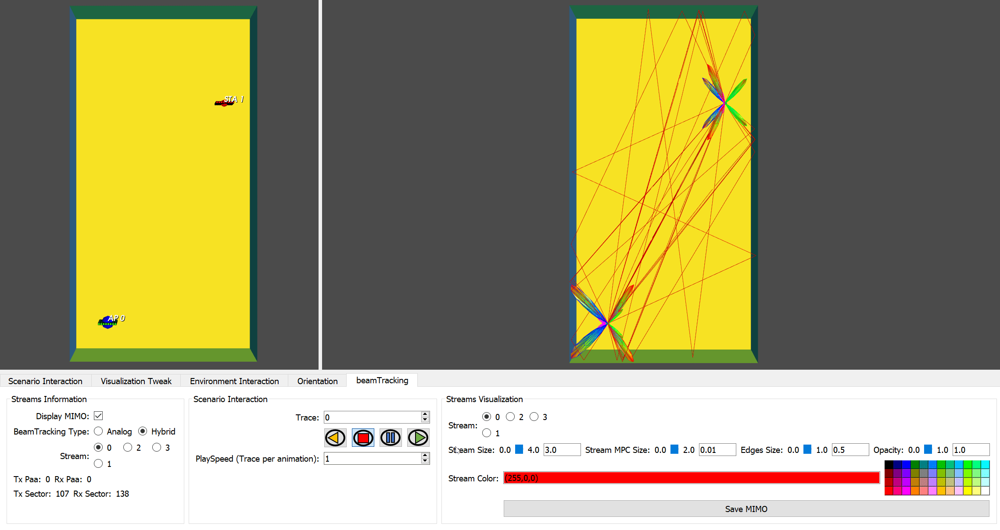

You can observe that it is slower to render hybrid beamtracking results. It is expected as for every trace, the resulting hybrid beam patterns must be computed in the visualizer. 


## Customize MIMO visualization

The MIMO visualization can be customized and in particular for a selected stream:
* The size of the transmitter/receiver antenna patterns.
* The MPCs size.
* The edges size.
* The opacity of the transmitter/receiver patterns.
* The color of the selected stream antenna patterns and MPCs.

To customize the view, open either `suMimo`, `muMimo` or `beamTracking` tab in the GUI depending on the MIMO mode you are using.
Then, select the stream that you want to configure using the `Stream` field. The selected stream antenna patterns size can be adjusted using `Stream Size` field. The selected stream MPCs size can be changed using `Stream MPC size` field. The selected stream edges size can e adjusted using `Edges size` field. The selected stream opacity can be changed using `Opacity` field. Finally, the MPCs and antenna patterns colors can be changed using the `Stream Color` field. 

The picture below show a configuration done to put the emphasis on the stream `0` in [SU-MIMO BT ns-3](#su-mimo-bt-ns-3-results) case.

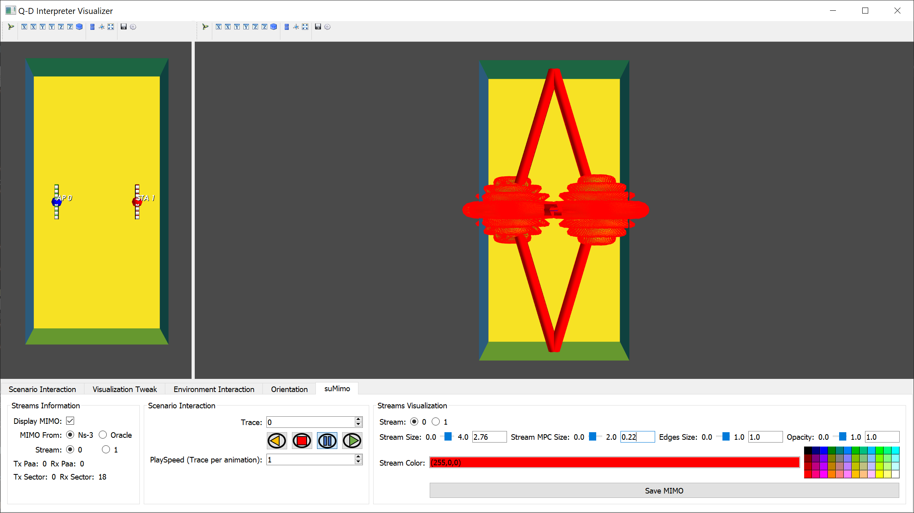

# Sensing visualization

We recently started to extend the NIST Q-D framework to create an Integrated Sensing and Communication (ISAC) framework (see these two contributions: [contribution 1](https://mentor.ieee.org/802.11/dcn/21/11-21-0746-01-00bf-q-d-simulation-modeling-framework-for-sensing.pptx) and [contribution 2](https://mentor.ieee.org/802.11/dcn/21/11-21-0747-01-00bf-a-preliminary-channel-model-using-raytracing-to-detect-human-presence.pptx)).
We thus extended the NIST Q-D Interpreter to be able to visualize sensing results.

The new features allows to:
* Visualize the targets to sense. In our case, the targets are humans represented thanks to a Boulic model (it is worth mentionning that the framework can work with any kind of targets as long as it is represented with connected joints).
* Visualize the MPCs from the sensing transmitter to the targets, and from the targets to the sensing receiver.
* Visualize the doppler range map.

The scenario used to demonstrate sensing visualization is `SensingTwoTargets`. The scenario is made of one sensing transmitter (AP0) and one sensing receiver (AP1). Two targets are moving in the room and the scenario is made of 2680 traces.  

## Configure the sensing visualization

To launch the `SensingTwoTargets` scenario, execute the following command:

`python qdVisualizer.py --s SensingTwoTargets --sensing`

Once the visualizer is launched, to configure the sensing visualization, click on the `Sensing` tab in the GUI. 

You can either enable or disable the communication MPCs (from the selected transmitter to the selected receiver). For this, use the `Display Tx/Rx MPCs` checkbox as shown below.

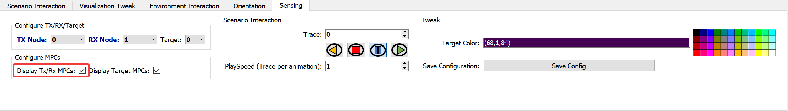

You can either enable or disable the targets MPCs (from the selected transmitter to the target selected and from the target selected the selected receiver). For this, use the `Display Target MPCs` checkbox as shown below.

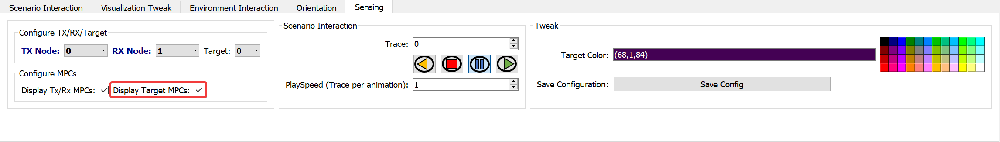

The Q-D Interpreter allows to select the target you want to visualize. For this, use the `Target` field to select the target you want to display as shown below.
It is worth mentionning that you can display all the targets in the scenario by setting `Target` field to `All`.

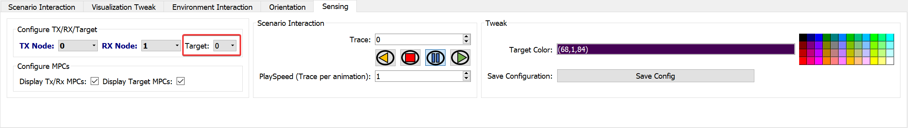

You can also modifiy the selected target color by using the `Target Color` selection list as shown below:

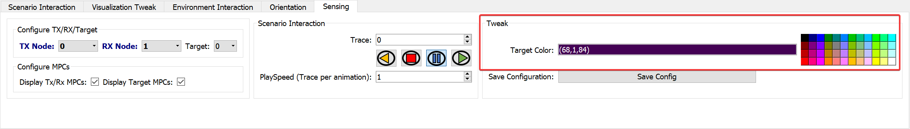

By default, each target is assigned a different color and the Target MPCs are colored with the same color as the target. 

## The SensingTwoTargets sensing scenario

To iterate through the traces, it works as presented previously. However, channels generated for sensing operations have a higher sampling rate. It is thus recommended to change the `Playspeed` field in the GUI to larger value than `1`. Please try for example with a value of `128` as displayed below.

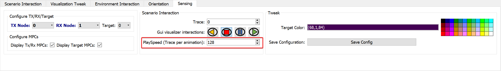

Please note that for the sensing analysis, the `left` view might not be needed. You can for example move the AP and STA components to display them on the `right` view. To do so, just select `view2` as displayed below for `Nodes`, `Nodes Labels`, and `PAAs`. 

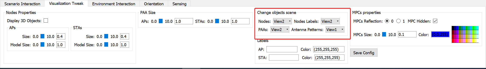

You can then resize the window to get rid of the `left` view. 
When ready, you can now press the `play` icon and observe the sensing scenario as displayed below. 


# More about the Oracle mode

The oracle mode brings some additional features that will be described in this section. To do so, we will use the `VRArena` scenario.
This scenario is made of 6 static APs and 6 STAs that are both moving and rotating. The number of traces is 1000 and represent a subset of the 30,000 traces used in this [article](https://ieeexplore.ieee.org/abstract/document/9443328). Please note that the codebook is made of 54 backbaffled sectors. 

## Visualize STAs associations

To launch the scenario, excute the following command:

`python qdVisualizer.py --s VRArena --sls --dataMode preprocessed`

Please note that the generation of the `preprocessed` data will take some time. 

Once the visualizer is launched, click on the `Display STAs association` checkbox as displayed below.

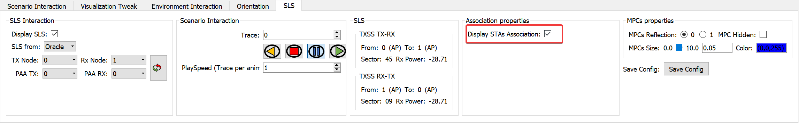

Now, each STA is having a colored 3D transparent sphere surrounding it. The colored sphere is having the color of the AP to whom the STA is associated. The association is decided based on the AP that provides the best received power after the SLS phase (and this for every trace).

The video below shows all traces and the evolution of the association. Please note that first, we setup the `playspeed` to 20. Then, `STA9` is the only STA that changes AP to which it is associated (the association sphere goes from light blue, i.e., associated to AP2, to darker blue, associated to AP1).

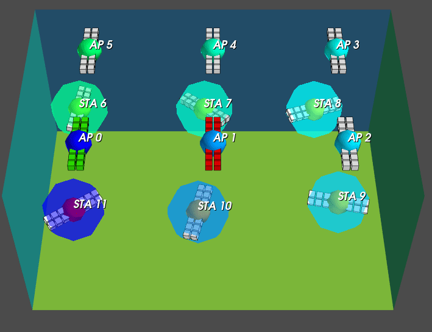

Now, if you select as a `Tx Node` a STA, and as a `Rx node` an AP, a new option is appearing: `Show Best AP for STA`. In this mode, the visualizer will not show the SLS results from the selected transmitter (which must be a STA) to the selected receiver (which must be an AP), but from the selected transmitter to the AP to whom it is associated.

The video below shows the SLS results when STA9 is selected. We can clearly see that the SLS results are displayed from STA9 to the AP to whom it is associated. 


## Additional information generated when `preprocessed` mode is used

The `preprocessed` mode generate extra-information when used. For example, for the `VRArena` scenario, it generates a `graph` folder (located in `src\VRArena\Graph` folder). This folder contains three additional folder: `Association`, `Mobility`, and `SLS`.

`Association` folder contains for each AP and for all traces the location of the STAs associated to it (upper part of the graph), as well as the density location map of the STAs associated. The picture below shows this graph for `AP0`. 

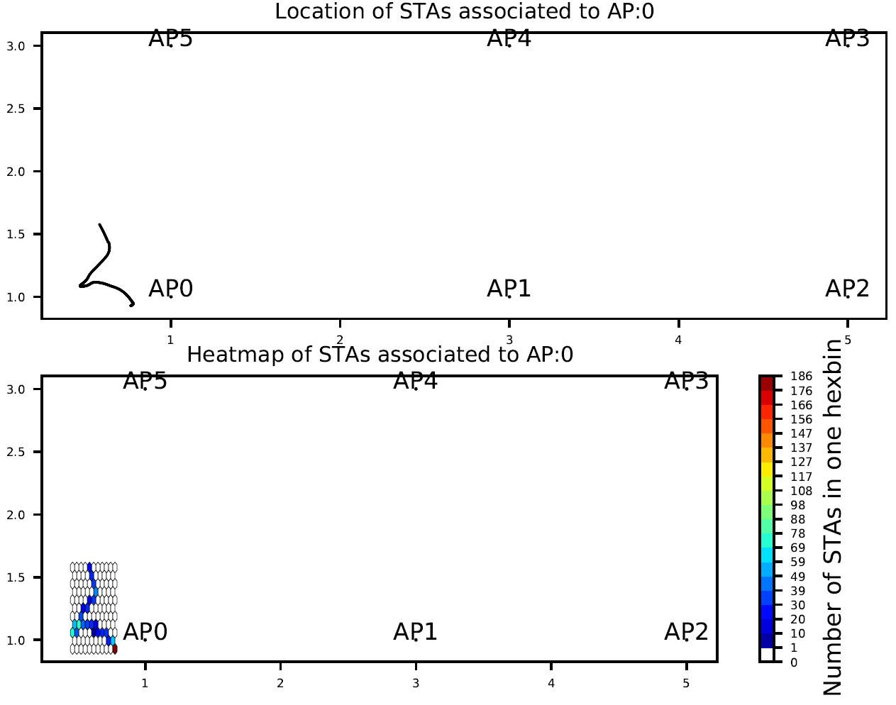

`Mobility` folder contains two files: `AllStasHexBinHeatmap.pdf` and `STAsMobility.pdf`. 

`AllStasHexBinHeatmap.pdf` contains the density map of all the STAs for all the traces of the scenario and can be seen below.

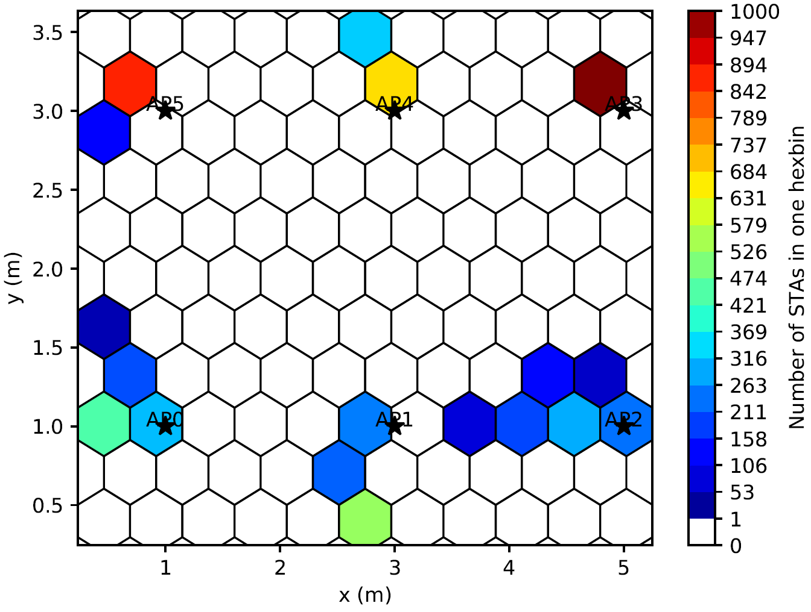

`STAsMobility.pdf`contains the mobility information for APs and STAs and can be seen below. 

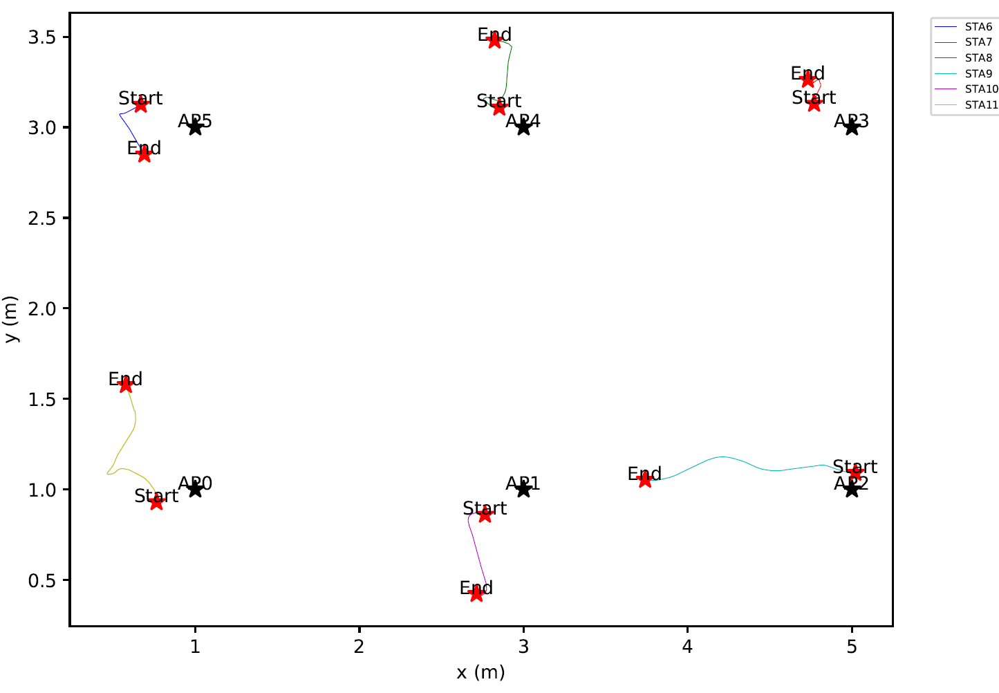

Finally, `SLS` folder is made of two subfolders: `BestSectorITXSS` and `RxPowerITXSS`. 

`BestSectorITXSS` contains the best sectors determined during the SLS BT for every traces and for every pair of nodes in the network.

`BestSectorITXSS` contains the receiver power for every trace between every pair of node in the network. The sector used for the transmission is the one determined by the SLS BT. 

## Oracle and scheduling

For the need of this [article](https://ieeexplore.ieee.org/abstract/document/9443328), we developped a minimal scheduler. The scheduler operates by computing the downlink link (from the APs to the STAs).
The scheduler is simple and allocates for each STA associated to a given AP, a total duration of:

```t = timeSlot/nbStasAssociated```

The timeslot is the duration of a trace, which is set to 4ms in the `VRArena` scenario. `nbStasAssociated` is the total number of associated STAs to the AP and depends of the association mode. We defined two different mode:
* **Same AP**: At the first trace of the simulation, the STA associates to the best AP (in term of received power) and stays associated to it until the end of the simulation.
* **Best AP**: At each trace, the STA associates to the AP that gives it the best received power. 

The scheduler is implemented in `qdSchedulingExample.py` that can be found in the `src` folder. 

To execute it, use the following command:

`python qdSchedulingExample.py --s VRArena --sls --dataMode preprocessed`

This program will compute all the downlink transmissions using the two association modes. Once done, it creates two new folders in the `Graph` folder: `AssocBestAP` and `AssocSameAP`. 

Each of this folder contains one subfolder `AllSTAs`. This subfolder is made of four subfolders: `Association`, `Capacity`, `Scheduling` and `SNR_SINR`. 

* `Association` contains one graph per AP showing for all the traces the number of STAs associated to the AP.
* `Capacity` contains the theoritical downlink capacity for each AP for all the traces. 
* `Scheduling` contains a graphical representation of the scheduled downlink transmission.
* `SNR_SINR` contains the evolution of the SNR and SINR for each AP for all the traces. 

The picture below shows the `Scheduling` representation when the mode is set to `Best AP`. 

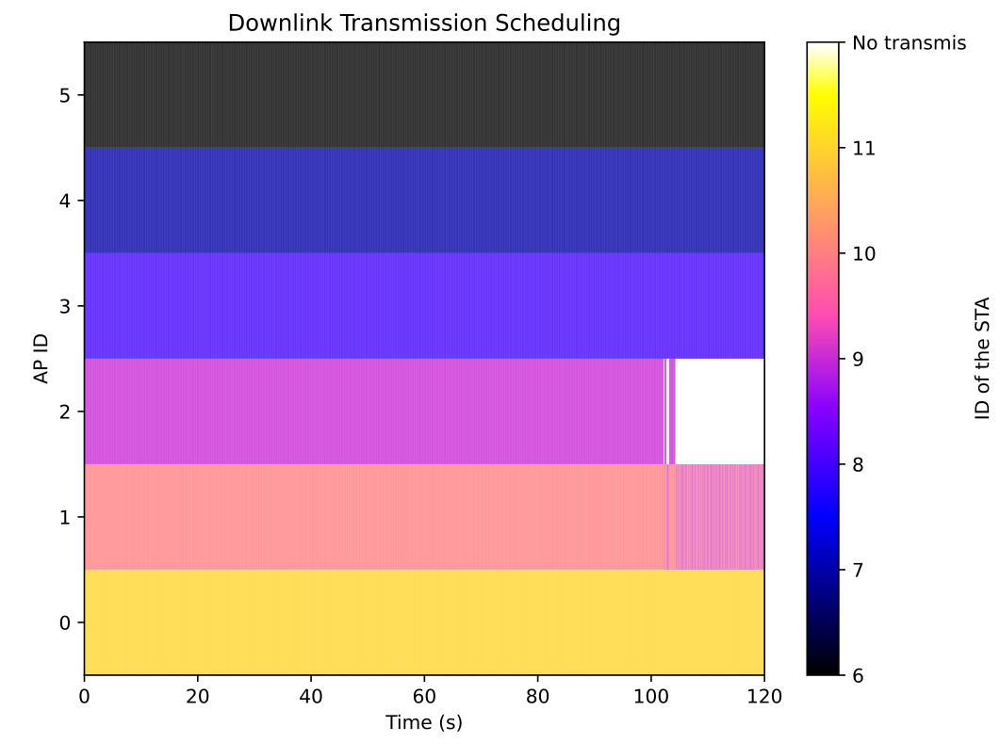

We can see that the `STA9` switches from `AP2` to `AP1` around the 105th traces and that AP1 has now to schedule downlink transmissions to two STAs (STA9 and STA10). 

## Oracle and Machine-Learning

Machine-Learning can help to reduce the overhead due to the SLS phase. Indeed, performing an exhaustive sector search can produce a large overhead. 
We implemented a preliminary ML scheme to try to predict the sectors combination to test instead of performing an exhaustive search. 

This ML scheme can be used for the following:
* Predict the transmit sectors to use for the BT from AP0 to all STAs.
* Predict the transmit sectors to use for the BT from all STAs to AP0.
* Predict the transmit sectors to use for the BT from all STAs minus STA 11 to STA11. 

These 3 uses-cases are designed due to the mobility and rotation of the nodes. The APs remain static so we asssume it is easier to infer a relationship for the transmit sector to use from the APs to the STAs. The STAs are not only moving but rotating so it is harder to predict the transmit sector to use from the STAs to the APs. Finally, the most challenging case is from a STA to another STA as both are moving and rotating.

We implemented three flavors of the ML scheme regarding to the input data. One can use either:
* The STAs coordinates.
* The STAs rotation.
* The STAs coordinates + rotation.

To evaluate the performance, `top K` approach is used, i.e., if the best transmit sector (ground truth) is among the `K` predicted transmited sector, the accuracy is `1`. 

In order to be able to launch the ML code, the following additional packages are needed: 
* `tensorflow`
* `scikit-learn`

To launch the ML example, execute the following command:

`python qdMlExample.py --s VRArena --sls --dataMode preprocessed`

Once the simulation is over, a new `MachineLearning` folder is created in the `Graph` folder. It contains an `SLS` subfolder that is made of three subfolders: `Coordinates`, `Rotations`, and `CoordinatesAndRotations`. 

Each of these folders contains a graph for each mode (APs toSTAs, STAs to APs and STA to STA) as well as a `.csv` file with a summary of the results. 

Please note that the `VRArena` scenario contains only the first 1000 traces of 30,000 traces used in this [article](https://ieeexplore.ieee.org/abstract/document/9443328). The first 1000 traces contains the start of the measurements and at such does not exhibit a lot of mobility. If you are interested to obtain the entire dataset, just contact us. 

# MISC

## About Codebook and antenna patterns

The NIST Q-D framework operates using the Codebook generator to implement PAA properties. The codebook generator produces one file that contains different information needed to compute the PAA directivities (steering vectors, sectors Antenna Weights vector, etc). The NIST Q-D interpreter uses the codebook file to:
* Compute the directivity of a given sector for the oracle mode
* Display the sectors 3D antenna pattern

### How to add codebooks
The codebook files are located in `src\Codebook` folder. If you want to import new codebooks, you must place the new codebooks in this folder. 

If not specified, the default codebooks are:
* for the AP: `ura_28x_siso_37sectors.txt`
* for the STA: `ura_28x_siso_37sectors.txt`

To specify the codebooks to use by the APs and the STAs for a given scenario, you must add a file named `codebookConfiguration.csv` at the root of the scenario.
The format of the file is the following.

```
CODEBOOK_AP,CODEBOOK_STA
codebookApFile.txt,codebookStaFile.txt
```

Just replace `codebookApFile.txt` and `codebookStaFile.txt` with the name of the codebooks you want to use for the APs and STAs nodes.


### How to visualize codebooks

The NIST Q-D interpreter also allows to visualize a given codebook. For this, you have to use the `--codebook` option.

For example, if you want to visualize the codebook of the `LRoom` scenario (which are the default codebook), execute the following command:

`python qdVisualizer.py --s LRoom --codebook`

A new tab `codebook` will appear in the GUI as displayed below.

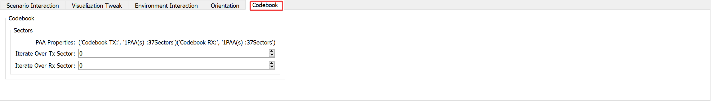

You are now able to visualize the antenna patterns corresponding to each codebook sector as displayed in the video below. 

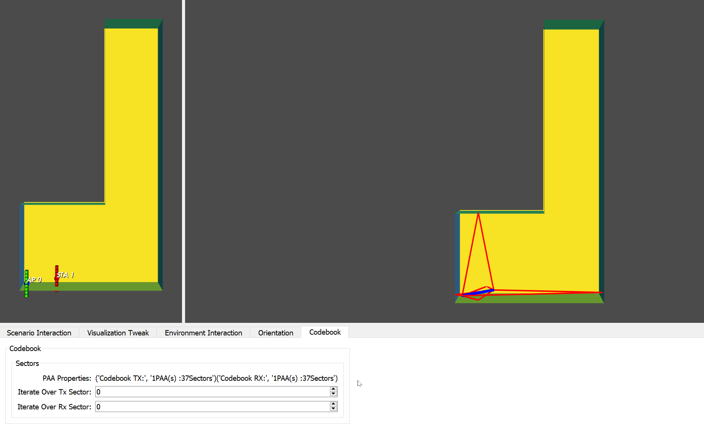

### How to change codebook antenna pattern visualization quality

By default, the quality of the antenna patterns quality are sliced to speed-up the creation of the antenna patterns while launching the visualizer as well as to speed-up the antenna patterns display during the visualization.

You may want to set the visualization to higher quality (slower), or lower quality (faster) depending on your need. To setup the quality, you have to use the option `--patternQuality`.

To launch the `LRoom` scenario with maximum antenna patterns quality, `patternQuality` option must be set to 1 as displayed in the command below. 

`python qdVisualizer.py --s LRoom --sls --dataMode online --patternQuality 1`

By default, the antenna pattern quality is set to `4`, i.e, the antenna pattern quality is sliced by 4 in azimuth and elevation. It offers a good compromise between speed and quality. 

Below, you can see the same antenna pattern with a `patternQuality` set to `1`, `4,` and `10`. 


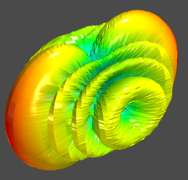

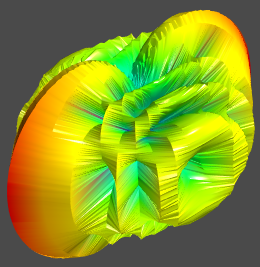

### Linear or dB representation

The NIST Q-D Interpreter allows to represent the antenna patterns directivity in `linear` or `dB`. By default, the antenna patterns are displayed in `dB`. 
To switch to `linear`, the option `codebookMode` must be used. 

For example, you can try to launch the `LRoom` scenario with `linear` directivity using the following command:

`python qdVisualizer.py --s LRoom --sls --dataMode online --codebookMode linear`

It is now displaying the linear antenna patterns directivity as displayed below:

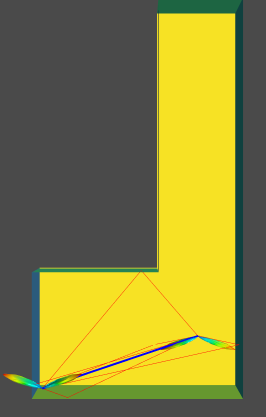


## Assign devices role
The NIST Q-D Channel Realization software is in charge of generating the channels. It is the cornerstone of the generation of a scenario. This software does not have a notion of APs or STAs. It just computes the channel between every pair of devices that are present in the scenario. As AP and STA can have different codebooks, system-level simulation such as ns-3 needs to decide wich devices is an AP and which devices is a STA when importing the generated channel. 
To solve this problem, the convention is the following:
* In the NIST Q-D Channel Realization software, when setting the devices, the first N devices will always be the APs (from a system-level POV). The following M devices will be the STAs (so a total of N+M devices in the scenario). It explains the ID of the labels of the nodes displayed in the visualizer, i.e., APs ID label will always start at 0, while STA ID labels will start at N. 
* A configuration file is used in ns-3 to allocate which devices are the APs and which devices are the STAs and to read properly the channel generated by the NIST Q-D Channel Realization software. This file is also packing an additional information not used in the NIST Q-D Interpreter which is to which AP each STA is initially associated to. For the genericity of the framework, we decided to reuse the same file format in the the NIST Q-D interpreter even if we do not need the association information.

You can find below an example of node type configuration below:
```
 2 // Number of APs in the scenario
 0 // Definition of the first AP ID - ID starts at 0
 1 // Number of STAs associated to AP 0
 2 // ID of the STA associated to AP 0
 1 // Definition of the second AP ID
 1 // Number of STAs associated to AP 1
 3 // ID of the STA associated to AP 0
```

 In case you have more than one STA to associate to one AP, two option are offered:
```
  // Option 1: Define every STA associated to the AP and use ',' as a separator
  3,4,5,6,7
  // Option 2: Define the lower ID and higher ID of the STAs associated to the AP and use ':' as a separator
  3:7
```

For a scenario, you must either:
* Place a file named `nodesConfiguration.txt` using the format defined above at the root of the scenario
* Use the default configuration of the NIST Q-D Interpreter. By default, the first node is considered as an AP and all the other nodes are set to be STAs. 

## How to add textures and new 3D Model

### Add custom textures
The NIST Q-D interpreter allows to add your own texture in order to change the visual appearance of each face. For licencing reasons, the NIST Q-D Interpreter is just provided with placeholder textures.
To import your own texture, navigate to the `src\Pictures\Textures` folder and copy your texture. The texture format must be `.jpg` in order to be used in the visualizer. 

For the purpose of this example, we proceeded to the import of two textures:
* A brick wall texture with NIST logo
* A hardwood floor texture

We use the `LRoom` scenario to demonstrate the setting of textures. To lauch this scenario, execute the following command:

`python qdVisualizer.py --s LRoom`

Click to the `Environment Interaction` tab in the GUI. Then, select the face you want to texture and select the texture you want to allocate to the selected face using the `Texture` field in the GUI as displayed below.

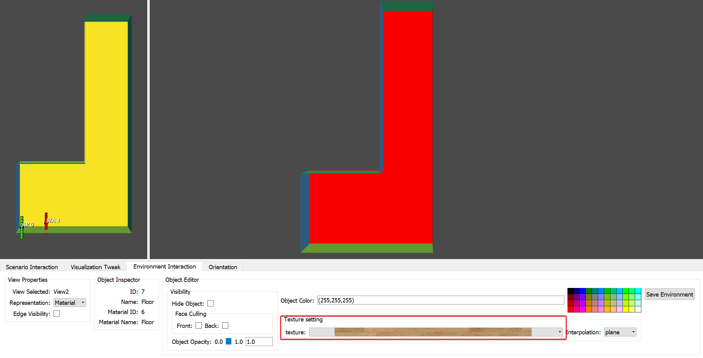

Once done, do not forget to set the view to `Texture` mode by changing the `Representation` field in the GUI to `Texture` as displayed below.

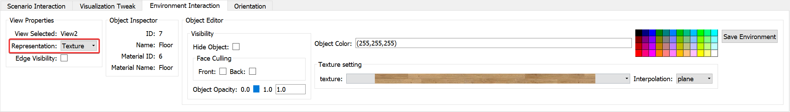

You can see below the results of a textured `LRoom` scenario. 

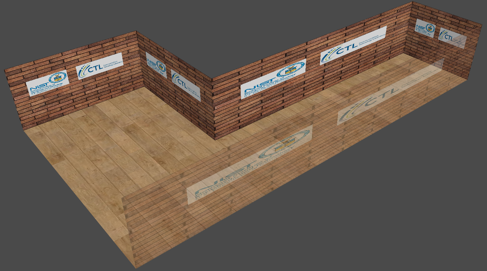

Please note that the Q-D Interpreter allows to import already textured 3D environment. If you're interested about this feature, just contact us. 

### Add custom 3D models for APs and STAs

The NIST Q-D Interpreter comes with simple 3D models for APs and STAs. However, you can import your own 3D models as long as the format is `.obj`. The model can be textured.
To do so, import the 3D models you want to assign to STAs and APs to `src\3DObjects`.
Then, open the `qdVisualizer.py` file located in `src` folder and look for these two lines.

```
defaultStaModel = "staDefault.obj"
defaultApModel = "apDefault.obj"
```

Replace the name of the default files with the files you have just imported. 

For the purpose of this example, we assigned to the AP a more detailed AP 3D model, and a VR Headset for the STA. 

 We use the `LRoom` scenario to demonstrate the new 3D models. To lauch this scenario, execute the following command:
`python qdVisualizer.py --s LRoom`

Now, select the `Visualization Tweak` tab in the GUI and click on `Display 3D Objects` and you should obtain the visualization displayed below. 

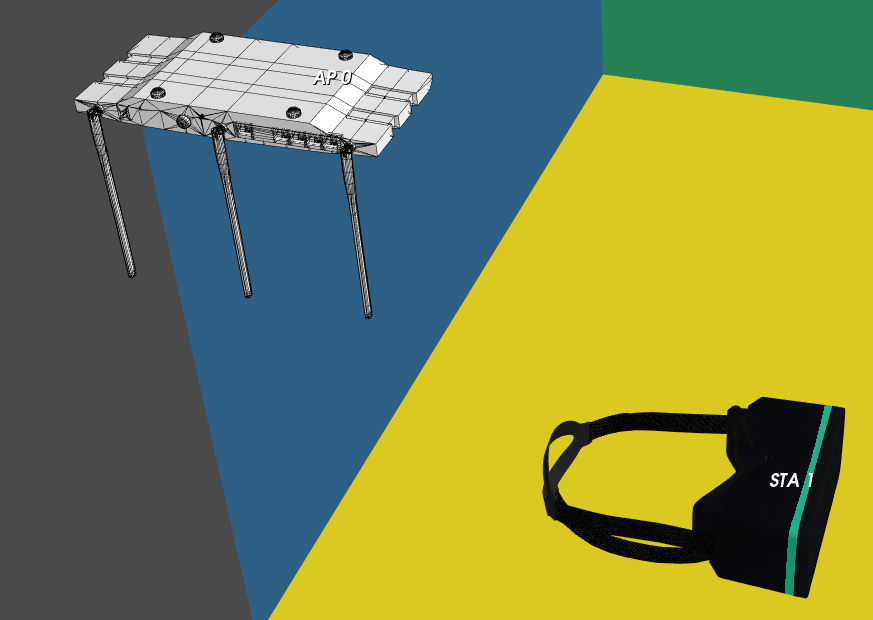

## Orientation

The NIST Q-D Interpreter allows to display devices (STAs+APs) and PAA orientations.
To visualize device orientation, click on the `Orientation` tab in the GUI. Then, you can display either Transmitter Device or Receiver Device Orientation using the `Device Orientation` field. You can either display Transmitter or Receiver PAA orientation using the `PAA orientation` field. 

The picture below shows all the orientations when the transmit device selected is `0` and the `rx` device selected is `1`. The PAAs orientation are displayed on the `left` view while the devices orientation are displayed on the `right` view. 

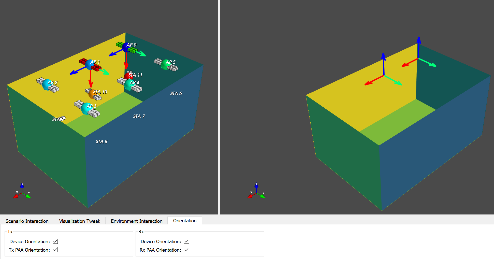

# Author Information:
The Q-D Interpreter is developed and maintained by [Tanguy Ropitault](https://www.nist.gov/people/tanguy-ropitault).

[Steve Blandino](https://www.linkedin.com/in/steve-blandino) developped the traces system exported from the NIST Q-D Channel Realization software. 

[Hany Assasa](https://be.linkedin.com/in/hany-assasa) and [Nina Grosheva](https://networks.imdea.org/team/imdea-networks-team/people/nina-grosheva/) developped the traces system exported from ns-3 IEEE 802.11ad/ay.
