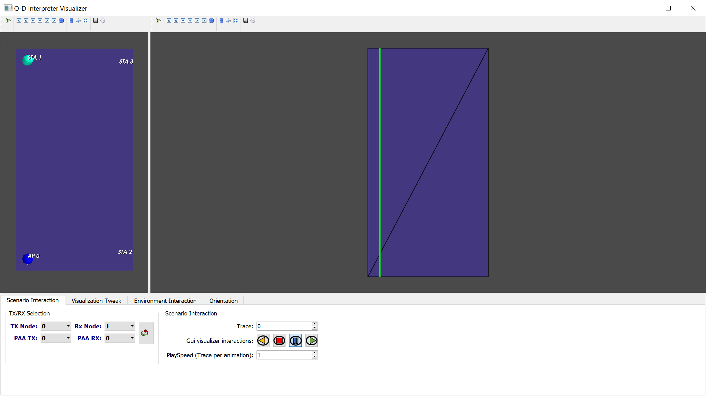

# opensource-repo
This repository is the recommended template repository for NIST opensource contributions.


# The NIST Q-D Interpreter Software

The NIST Q-D Interpreter software has been developed to help visualizing Beamforming Training (BT) results using 3D visualization. This software is part of the [NIST Q-D Framework](https://github.com/wigig-tools) and at such is using input for both the [NIST Q-D Channel Realization software](https://github.com/wigig-tools/qd-realization) and [ns-3 802.11ad/ay implementation](https://github.com/wigig-tools/wigig-module).

The NIST Q-D Interpreter software is developed in Python and uses the [Mayavi](https://docs.enthought.com/mayavi/mayavi/) library. 
It provides a flexible, scalable 3D visualizer to analyze BT results and more particularly:
* Sector-Level-Sweep (SLS) BT
* MIMO BT
* Beamtracking results

Recently, sensing visualizations were added to allow:
* Visualization of human targets moving and their associated Multi-Paths Components (MPCs)
* Visualization of the doppler range map

It is worth mentioning that the The NIST Q-D Interpreter software comes with its own implementation of the Q-D propagation model which allows to visualize the BT results without having to use system-level simulations.

This wiki is organized as follows:
* Section [Installation](#installation) describes how to install the NIST Q-D Interpreter software
* Section [First Steps](#first-steps) helps to user to get familiar with the visualizer. In particular, it shows how to launch the visualizer and configure the different visualization options to customize the visualizer appearance
* how to visualize \gls{SLS} \gls{BT} results

# Installation

# First Steps

To launch the visualizer, the scenario name must be specified using the `--s` option. The command below displays the command to execute a scenario named `scenarioName`.
 
`$ python qdVisualizer.py --s scenarioName`

For the purpose of this document, we will use the _Raw Spatial Sharing _scenario as an example scenario. It gives us the following command:

```$ python qdVisualizer.py --s RawSpatialSharing```

The first time a scenario is launched, it just reads the input from the \qdsoftware software and ns-3 and nothing is configured for the visualization itself. Once the \software is launched, you should obtain the visualization displayed on Fig.~\ref{fig:rawSpatialSharingInit}.





We can observe that the \software is made of two main windows that we will refer to as \textit{Left View} and \textit{Right view}. The first time that a scenario is launched, all the faces of the 3D geometry of the environment are set to be opaque. The first thing to do is to configure the visualization correctly to display what we want to visualize. For an indoor scenario, we must select the faces to hide in order to visualize the indoor environment. To do so, click on the \textit{Environment Interaction} tab in the menu. Then, select the top face of the left view. It should be now colored in red to state that it's currently selected. Finally, 

\begin{figure}[t!]
\centering
\begin{subfigure}{0.4\textwidth}
  \centering
  \includegraphics[width=7in]{Figures/RawSSFrontFaceCulling.png}
  \caption{Default scenario}
  \label{fig:visualizer1}
\end{subfigure}% 

\begin{subfigure}{0.4\textwidth}
  \centering
  \includegraphics[width=7in]{Figures/RawSSBothTopFacesCulled.png}
  \caption{Scenario with multiple \glspl{paa} per device}
  \label{fig:visualizer2}
\end{subfigure}
\caption{Screenshots of in-built visualization app.}
\vspace{-0.5cm}
\label{fig:visualizer}
\end{figure}


\begin{figure}[t!]
\center
\includegraphics[width = \columnwidth]{Figures/RawSSFirstLaunch.png}
\caption[]{Initial view of the raw Spatial Sharing scenario}
\label{fig:rawSpatialSharingInit}
\end{figure}


# Q-D Interpreter
This repository contains the Q-D Interpreter implementation. The Q-D Interpreter can be used in two ways:
1. With visualizer (mainly to check Beamforming Training Results and the correctness of the scenario). The python script to use is: qdVisualizer.py. **NEERAJ**
1. Without visualizer (mainly to perform Capacity computations and Machine-Learning tasks). The python script to use is: qdSchedulingMlExample.py **RAIED**

## Features:
1. This application allows to visualizer the beamforming training evolution, and in particular, the SLS TxSS phase. Each beamforming training is visualized thanks to the directivity of the antenna pattern resulting of the beamforming training SLS phase.
1. The Multi-Paths components between a pair of transmitter/receiver are displayed.
1. The system level performance (Capacity/Power Receiver per Sector, etc.) can be visualized
1. Perform Machine-Learning Beamforming-Training 
1. Compute capacity

The Q-D Interpreter comes with a test Scenario _(ScenarioAsilomar6ap6sta)_ that helps the user to get familiarize with the framework. To access more complex scenario, please send an email to tanguy.ropitault@nist.gov.


Here is a sample snapshot for our Q-D visualizer:


# Download Information:
Just clone or download the repository.

# Installation
1. If you want to use the Q-D Interpreter with visualizer, please refer to *"InstallVisualizer.md"* document in the *"docs"* folder or click directly [here](https://gitlab.nist.gov/gitlab/tnr1/qdInterpreter/-/blob/master/docs/InstallVisualizer.md). **NEERAJ**
1. If you want to use the Q-D Interpreter without visualizer, please refer to *"InstallWithoutVisualizer.md"* document in the *"docs"* folder or click directly [here](https://gitlab.nist.gov/gitlab/tnr1/qdInterpreter/-/blob/master/docs/InstallWithoutVisualizer.md). **RAIED**

# Usage 
1. If you want to use the Q-D Interpreter with visualizer, please refer to *"ReadmeVisualizer.md"* document in the *"docs"* folder or click directly [here](https://gitlab.nist.gov/gitlab/tnr1/qdInterpreter/-/blob/master/docs/ReadmeVisualizer.md). **NEERAJ**
1. If you want to use the Q-D Interpreter without visualizer, please refer to *"ReadmeWithoutVisualizer.md"* document in the *"docs"* folder or click directly [here](https://gitlab.nist.gov/gitlab/tnr1/qdInterpreter/-/blob/master/docs/ReadmeWithoutVisualizer.md). **RAIED**


# Author Information:
The Q-D Interpreter is developed and maintained by [Tanguy Ropitault](https://www.nist.gov/people/tanguy-ropitault).

# Author Information:
The Q-D Interpreter is developed and maintained by [Tanguy Ropitault](https://www.nist.gov/people/tanguy-ropitault).